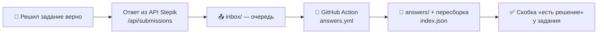
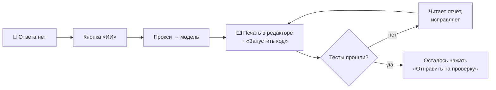

<div align="center">

# ⚡ Stepik Fast Complete

**Юзерскрипт для stepik.org: сам сохраняет зачтённые ответы, вставляет их одним нажатием и решает задания, которых ещё нет в общей папке.**


[Что это](#-что-это) • [Возможности](#-возможности) • [Как работает](#-как-это-работает) • [Установка](#-установка) • [Использование](#-использование) • [Структура](#-структура-репозитория) • [FAQ](#-faq)

</div>

---

## 📖 Что это

**Stepik Fast Complete** — Tampermonkey-скрипт, который превращает прохождение курсов на [stepik.org](https://stepik.org) в пару нажатий.

Он делает три вещи: **сам сохраняет** правильные ответы в общую базу, **вставляет** их одним кликом при следующей встрече с заданием и **решает через ИИ** то, чего в базе ещё нет — прямо в карточке задания.

> [!IMPORTANT]
> Ответы берутся из **API самого Stepik** (`/api/submissions`), а не из вёрстки страницы. Поэтому скрипт не ломается от обновлений интерфейса, а в базу попадают **только проверенные** (`correct`) ответы.

> [!NOTE]
> База ответов общая и лежит в этом репозитории — в папке [`answers/`](answers/). Чем больше людей решают задания, тем полнее она становится.

---

## ✨ Возможности

- 💾 **Автосохранение.** Решил задание верно — ответ уехал в общую базу. Ничего нажимать не надо. Идёт сохранение — справа снизу крутится индикатор.
- 📥 **Вставка одним нажатием.** Рядом с заданием появляется скобка **«есть решение»** — жми `вставить`, и ответ оказывается в редакторе.
- 🤖 **Решение от ИИ.** Нет ответа в базе — нажми «ИИ». Решение печатается в редакторе построчно, запускается и самопроверяется.
- 🧩 **Все типы заданий.** Код, тесты с выбором, сопоставление, таблицы «отметьте верные ячейки», поля со свободным ответом.
- 🎯 **Самопроверка.** Не прошло — ИИ читает отчёт, исправляет и вставляет заново. Проваленные тесты в отчёте выделены красным.
- 📦 **Пакетный режим.** Пройти выбранные уроки подряд и собрать их в документ **Word** со скриншотами.
- 🔐 **Ключ не в браузере.** Запросы к ИИ идут через прокси, ключ живёт только на сервере. Свой ключ или прокси — в настройках.

---

## ⚙️ Как это работает

**Сохранение и вставка ответов** — скрипт кладёт новый ответ в очередь `inbox/`, а робот переносит его в базу:



**Решение через ИИ** — когда ответа в базе нет:



> [!TIP]
> Кнопку **«Отправить на проверку»** скрипт **не нажимает никогда** — отправка остаётся за тобой. В пакетном режиме это исключение: там он отправляет сам.

---

## 📦 Требования

| Компонент | Назначение |
| :--- | :--- |
| **Браузер** | Chrome, Edge, Firefox или Opera |
| **[Tampermonkey](https://www.tampermonkey.net/)** | менеджер юзерскриптов — обязателен |
| **Аккаунт на stepik.org** | собственно, где всё работает |
| **Токен записи** *(необязательно)* | чтобы ответы **сохранялись** в общую базу |

---

## 🚀 Установка

**1. Поставь [Tampermonkey](https://www.tampermonkey.net/)** — расширение есть для всех популярных браузеров.

**2. Установи скрипт** — открой ссылку и нажми **«Установить»**:

> **→ [Установить Stepik Fast Complete](https://raw.githubusercontent.com/NOTyeamu/Stepik-Fast-Complete/main/stepik-gist-sync.user.js)**

**3. Зайди на любой урок** на stepik.org. Настраивать ничего не нужно.

При первом запуске скрипт покажет короткое **знакомство**: где панель заданий, где скобка с готовым ответом и где чат с ИИ. Можно пропустить — посмотреть заново: **панель → Настройки → «Показать знакомство заново»**.

<details>
<summary><b>Как обновить скрипт</b></summary>

<br>

Tampermonkey проверяет обновления примерно раз в сутки. Чтобы обновиться сразу: значок Tampermonkey → **«Проверить обновления скриптов»**.

Если версия всё ещё старая — подожди пару минут, файл по ссылке обновляется с небольшой задержкой.

</details>

<details>
<summary><b>Как включить сохранение ответов (токен записи)</b></summary>

<br>

Без токена скрипт умеет только **вставлять** готовые ответы. Чтобы ответы ещё и **сохранялись**, нужен токен записи:

1. Значок Tampermonkey → **⚙ Токен записи**;
2. Вставь токен с правом **Actions: write** на этот репозиторий.

Токен хранится только у тебя в браузере. Права на изменение workflow-файлов у него нет, поэтому робота им не выключить.

</details>

---

## 🕹 Использование

### 📥 Скобка «есть решение»

Решил задание правильно — ответ сохранился. В следующий раз рядом с редактором появляется скобка:

> **есть решение** · `вставить` · `ИИ` · `нет`

- **вставить** — подставляет ответ в редактор или отмечает варианты в тесте;
- **ИИ** — решить это задание заново (если хочешь другой вариант);
- **нет** — убирает скобку до следующего раза.

### 🤖 Решение от ИИ

Нужен ответ, которого нет в базе? Нажми **«ИИ»** в скобке или **«Спросить ИИ»** внизу блока — под редактором появится чат с решением.

Что происходит дальше:

1. ИИ думает — в чате видно «ИИ пишет решение…» со счётчиком секунд;
2. **печатает решение прямо в редакторе** — построчно, как будто пишет человек;
3. **сам запускает код** и показывает вывод тут же, в чате;
4. не прошло — читает отчёт, **исправляет и вставляет заново**.

<details>
<summary><b>Тесты с галочками</b></summary>

<br>

Варианты показываются прямо в чате: слева **зелёный кружок**, если верный ответ один, или **зелёный квадратик**, если верных может быть несколько. Выбранное заливается — сразу видно, что отмечено на странице.

Если проверка не приняла ответ, скрипт запоминает, что этот вариант не подошёл, и выбирает **другой** — а не возвращает тот же самый.

</details>

<details>
<summary><b>Задания на сопоставление</b></summary>

<br>

Скрипт читает оба столбца, просит ИИ порядок и **расставляет значения сам**: в чате видно пары «подпись → значение», а на странице правый столбец встаёт на нужные места. Остаётся нажать «Отправить на проверку».

Ответ здесь короткий, поэтому скрипт берёт быструю модель и останавливает ожидание через 25 секунд, если сервис не ответил.

</details>

<details>
<summary><b>Таблицы «отметьте верные ячейки»</b></summary>

<br>

Таблица, где в каждой строке написан код, а отметить нужно один из столбцов. Скрипт читает строки и столбцы, спрашивает у ИИ столбец для каждой строки и **отмечает ячейки сам**:

```
int.TryParse("42", out int n)      →  true
int.TryParse("сорок", out int n)   →  false
int.Parse("abc")                   →  Ошибка (FormatException)
```

</details>

<details>
<summary><b>Задания, где ответ пишут в поле</b></summary>

<br>

Скрипт пишет ответ прямо в поле и говорит: «Осталось нажать «Отправить на проверку»». Запускать там нечего — редактора кода в таких заданиях нет.

</details>

<details>
<summary><b>Кнопки в шапке блока ИИ</b></summary>

<br>

| Кнопка | Что делает |
| :--- | :--- |
| модель | выбрать модель ИИ |
| 🗑 | **очистить чат** — начать разговор заново, блок остаётся на месте |
| ✕ | **закрыть окно** — вернуть блок можно кнопкой «ИИ» у задания |

</details>

### 📦 Пройти задания пачкой и собрать в Word

Кнопка в шапке урока (рядом с полноэкранным режимом) открывает панель вместо списка уроков:

| Кнопка | Что делает |
| :--- | :--- |
| **Пройти и отправить** | спрашивает диапазон уроков, проходит их, вставляет сохранённые ответы и нажимает «Отправить на проверку» |
| **Собрать в Word** | делает скриншоты заданий с кодом и собирает документ `.docx` |
| **Спросить ИИ по шагу** | решить текущее задание |
| **Остановить** | прерывает обход |
| **Настройки** | токен записи, ключ ИИ и адрес прокси (хранятся на твоём компьютере) |

> [!WARNING]
> Во время обхода вкладку лучше не закрывать: между заданиями страница перезагружается, но прогресс сохраняется.

### ⌨️ Горячие клавиши

| Клавиши | Действие |
| :--- | :--- |
| `Ctrl` + `Alt` + `I` | вставить сохранённое решение |
| `Ctrl` + `Alt` + `S` | сохранить ответ принудительно |
| `Ctrl` + `Alt` + `D` | отчёт самопроверки |

### 🧭 Меню Tampermonkey

| Пункт | Что делает |
| :--- | :--- |
| ✨ **ИИ: решить текущий шаг** | попросить решение для текущего задания |
| 📋 **Показать решение от ИИ** | вернуть на экран последнее решение |
| ⚙ **Токен записи** | нужен, чтобы сохранять ответы |
| 🔄 **Обновить список ответов** | подтянуть свежий список |
| 🧪 **Проверка хранилища** | покажет, всё ли на месте |

---

## 📁 Структура репозитория

```
Stepik-Fast-Complete/
├── stepik-gist-sync.user.js     # сам юзерскрипт (главный файл)
├── answers/                     # общая база ответов
│   ├── index.json               # индекс: шаг → файл, язык, вид (код / тест)
│   └── l<урок>_s<шаг>.<язык>    # ответы: код (.cs, .py, .cpp, …) или .json для тестов
├── .github/
│   ├── scripts/
│   │   ├── process.mjs          # переносит inbox/ → answers/, откатывает чужие правки
│   │   └── make-index.mjs       # пересобирает index.json
│   └── workflows/
│       └── answers.yml          # робот: push в inbox/ или answers/ + раз в 20 минут
├── .gitignore
└── README.md
```

### 🔒 Где хранятся ответы

Ответы лежат в папке [`answers/`](answers/) — **по файлу на задание**:

```
answers/l1793281_s8.cs     решение на C#
answers/l1793281_s9.json   тест с вариантами
```

База **только пополняется**: существующий файл никогда не перезаписывается. Испортить или удалить папку нельзя — её ведёт робот (`answers.yml`), который **откатывает любые правки, сделанные не им**. Права на изменение самих workflow-файлов у токена в скрипте нет, поэтому выключить робота он не может.

---

## ❓ FAQ

<details>
<summary><b>Ответ не сохраняется</b></summary>

<br>

Нужен **токен записи**: значок Tampermonkey → **⚙ Токен записи**. Без него скрипт умеет только вставлять готовые ответы.

</details>

<details>
<summary><b>Скобка «есть решение» не появилась</b></summary>

<br>

Обнови страницу. Если и после этого нет — значит ответа для этого шага в общей базе пока нет. Нажми в скобке **«ИИ»**.

</details>

<details>
<summary><b>ИИ не отвечает</b></summary>

<br>

Подожди немного и нажми ещё раз. Если ничего не меняется — напиши [в issues](https://github.com/NOTyeamu/Stepik-Fast-Complete/issues).

</details>

<details>
<summary><b>ИИ ответил «неполный ответ»</b></summary>

<br>

Модель упёрлась в свой лимит. Нажми «Спросить заново» или выбери модель посильнее — например **Kimi K2.7 Code** или **DeepSeek V4 Pro**.

</details>

<details>
<summary><b>Решение не вставилось в редактор</b></summary>

<br>

Обычно помогает нажать **«Изменить решение»** на странице (её показывает Stepik после неудачной отправки) и попросить ИИ снова. Скрипт делает это сам, но если страница была в необычном состоянии — попробуй вручную.

</details>

<details>
<summary><b>Упёрся в суточный лимит ИИ</b></summary>

<br>

Общий прокси ограничен суточным лимитом — скрипт скажет об этом прямо. Можно вписать **свой ключ** в «🔑 Настройки ИИ» или поднять свой прокси; тогда лимит будет твой.

</details>

---

## 📝 Заметки

- Скрипт работает **только на stepik.org** (`@match *://stepik.org/*`).
- Ответ берётся из API, а не из DOM — вёрстка и редактор ни на что не влияют.
- Модели выбираются в списке с уровнем «ума»: от быстрой `glm-5.3-flash` до `kimi-k2.7-code` и сильной `deepseek-v4-pro`.
- Обрезанный по лимиту ответ помечается как неполный и **в общую базу не попадает**.

## 📄 Лицензия

Лицензия не указана. Все права принадлежат автору — [@NOTyeamu](https://github.com/NOTyeamu).

<div align="center">

---

<sub>Открытый проект. Нашёл ошибку или есть идея — <a href="https://github.com/NOTyeamu/Stepik-Fast-Complete/issues">создай issue</a>.</sub>

</div>
